# AWS Lambda Image Processing Documentation  

## **Project Overview**  
This project implements a serverless image processing system using AWS services. It provides two methods for image processing:
1. **API Gateway**: Upload images via REST API which are processed and stored
2. **S3 Direct Upload**: Images uploaded directly to S3 bucket trigger automatic processing

When an image is processed, it's resized (50% of original size) and stored in a destination bucket, with comprehensive metadata stored in DynamoDB.

## **Project Deployment**
For project deployment watch [the deployment videos](https://drive.google.com/drive/folders/13yBcBNzPIiinOPi0GQ3oJkS33JOzvy2T?usp=drive_link)

---

## **Architecture**  
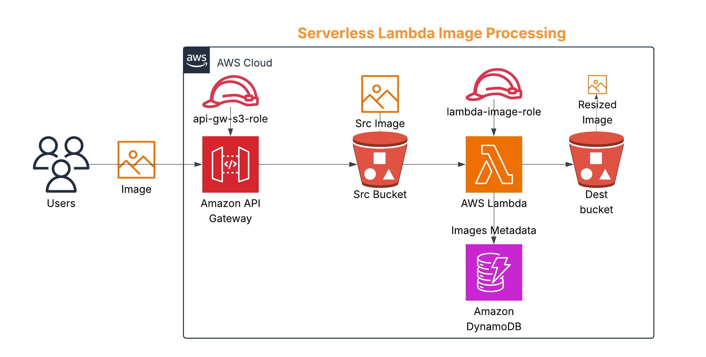  

## **Data Flow:**
1. **API Path**: Client → API Gateway → Src S3 → Lambda → (Dest S3 + DynamoDB)
2. **Direct Upload Path**: S3 Upload → Lambda → (Dest S3 + DynamoDB)

---

## **Key Components**  

### **1. API Gateway**  
- **API Name**: `Quaen-Hala-API`  
- **Endpoint**: `https://gns67mjs81.execute-api.eu-west-2.amazonaws.com/hala/`  
- **Method**: PUT `/{bucket}/{filename}`  
- **Role**: api-gw-s3-role (with permissions to write to S3 and CloudWatch)  
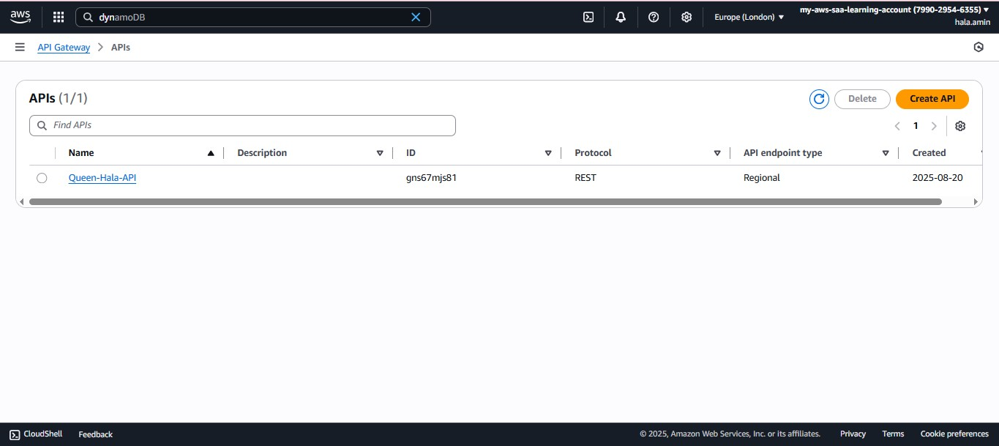  
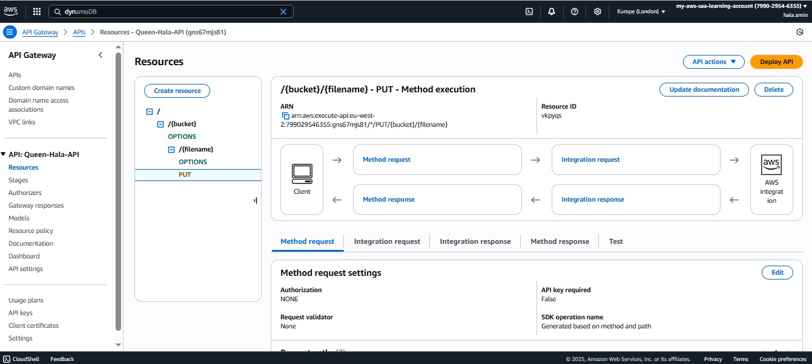
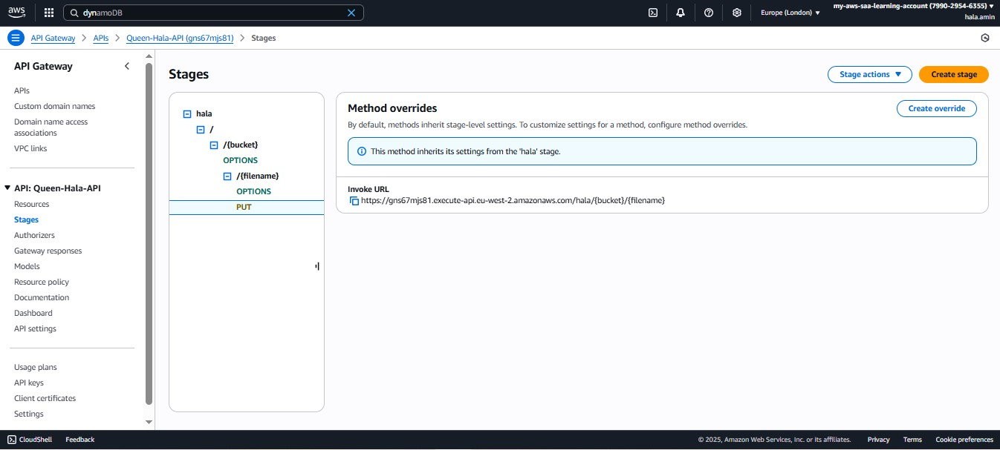

---

### **2. S3 Buckets**  
- **Source Bucket**: `src-bucket-image-in` (stores original images)  
  - Example objects: `cake.jpg` , `lambda-fun-test.jpg`  
  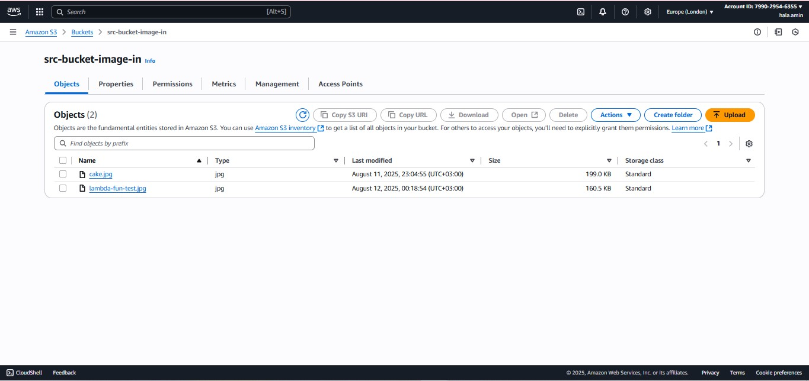  

- **Destination Bucket**: `dest-bucket-image-out` (stores resized images)  
  - Example objects: `resized-cake.jpg`, `resized-lambda-fun-test.jpg`  
  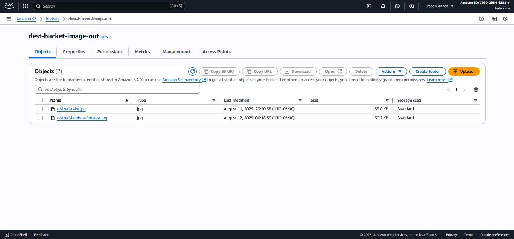  

---

### **3. Lambda Function**  
- **Function Name**: Landa-image-s3-function  
- **Runtime**: Python 3.12  
- **Trigger**: S3 `ObjectCreated:Put` events   
- **Permissions**: IAM role `lambda-image-role` with policy `lambda-image-policy`  

**python Code** ([lambda_function.py](aws-serverless-image-processor/lambda_function.py))   

---

### **4. DynamoDB Table**  
- **Table Name**: hala-db  
- **Partition Key**: resource-id (String)  
- **Stores**: Comprehensive image processing metadata including:
  - Original and resized image dimensions
  - File sizes and format information
  - Processing timestamps
  - Size reduction percentages
  - S3 event context information  
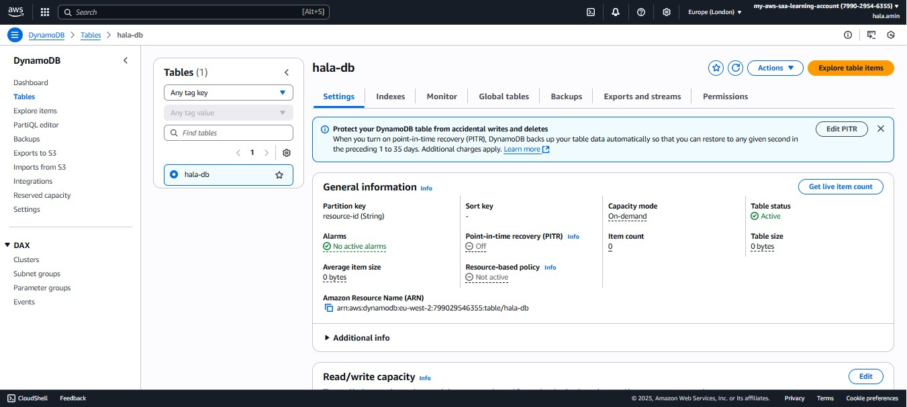  
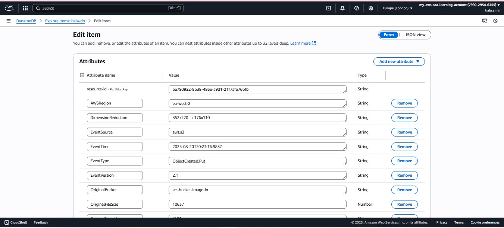  

---

### **5. IAM Roles & Policies**  

- **API Gateway Role**: `api-gw-s3-role`  
  - Policies: `AmazonAPIGatewayPushToCloudWatchLogs`, `lambda-image-policy`  
  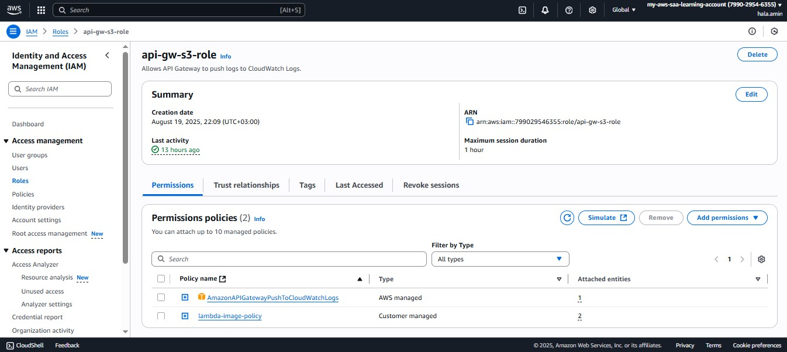  

- **Lambda Execution Role**: `lambda-image-role`  
  - Policy: `lambda-image-policy` (grants S3, CloudWatch Logs, and DynamoDB access)  

   
  
  **lambda-image-policy** ([lambda-image-policy.json](aws-serverless-image-processor/lambda-image-policy.json))  
 
---

## **Workflow**  

### **Option 1: API Upload**
1. Client PUT request to API Gateway:  
   `PUT https://gns67mjs81.execute-api.eu-west-2.amazonaws.com/hala/src-bucket-image-in/src.jpg`
2. API Gateway stores image in source S3 bucket
3. source S3 bucket triggers Lambda function
4. Lambda function processes image and stores comprehensive metadata in DynamoDB

### **Option 2: Direct S3 Upload**
1. User uploads image directly to `src-bucket-image-in`
2. source S3 bucket triggers Lambda function automatically
3. Lambda function processes image and stores comprehensive metadata in DynamoDB

### **Processing Steps:**
1. Image downloaded to Lambda /tmp directory with unique filename
2. Extract metadata from original image (dimensions, format, size)
3. Resized to 50% of original size using Pillow
4. Extract metadata from resized image
5. Resized image uploaded to `dest-bucket-image-out` with custom metadata
6. Comprehensive processing metadata stored in DynamoDB table `hala-db`
7. Temporary files cleaned up
8. Success response returned

---

## **Testing**  

### **1. Lambda Test Event:**
```json
{
  "Records": [
    {
      "eventVersion": "2.0",
      "eventSource": "aws:s3",
      "awsRegion": "eu-west-2",
      "eventName": "ObjectCreated:Put",
      "s3": {
        "bucket": {
          "name": "src-bucket-image-in"
        },
        "object": {
          "key": "cake.jpg"
        }
      }
    }
  ]
}
```

---

### **2. API Testing with Postman:**
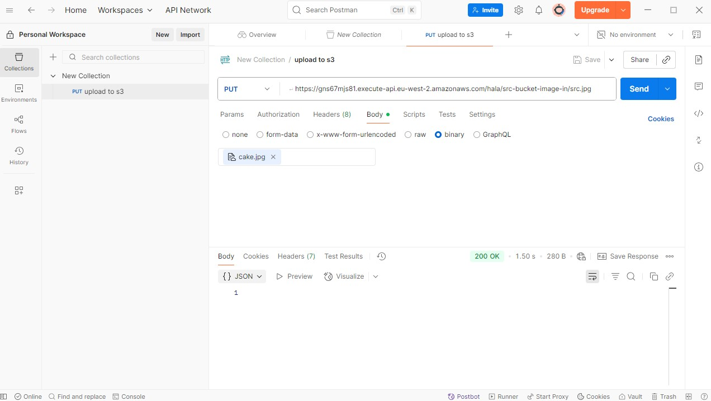  
- **Method**: PUT  
- **URL**: `https://gns67mjs81.execute-api.eu-west-2.amazonaws.com/hala/src-bucket-image-in/src.jpg`  
- **Body**: Image file as binary data

---

## **Monitoring & Logging**  
- **CloudWatch Logs**: Lambda execution logs and API Gateway access logs  
- **DynamoDB**: Comprehensive processing metadata 
- **S3 Metrics**: Storage and access metrics for both buckets  

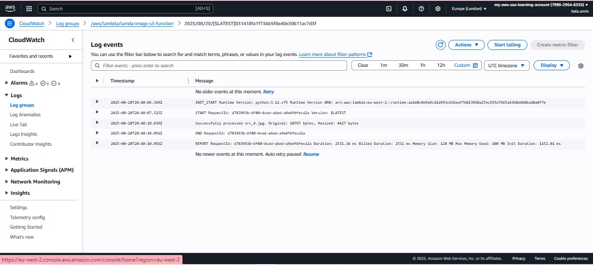  


---

## **Troubleshooting**  
- **API Gateway Errors**: Check API Gateway logs and IAM permissions for `api-gw-s3-role`
- **Lambda Execution Errors**: Check CloudWatch Logs for function errors
- **S3 Permission Errors**: Verify bucket policies and Lambda execution role permissions
- **DynamoDB Errors**: Check table permissions and configuration

### **Common Issues:**
1. **Library Dependencies**: Ensure Pillow is included in Lambda deployment package
2. **Temporary Storage**: Lambda /tmp directory has limited space (512MB)
3. **Timeout Settings**: Adjust Lambda timeout for large image processing (up to 1 minute)
4. **Memory Settings**: Increase Lambda memory for large image processing

---

#### **Dependencies**  
- **Python 3.12**  
- **Libraries**:  
  - `boto3` (AWS SDK)  
  - `Pillow` (image processing)  
  - `urllib3` (URL processing)  

---
