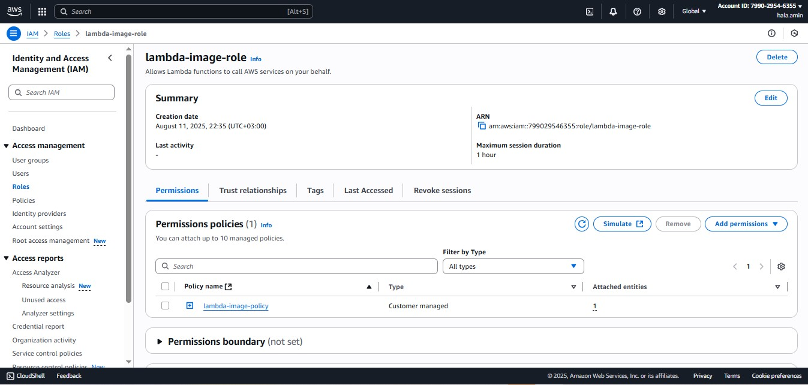

# AWS Lambda Image Processing Documentation  

## **Project Overview**  
This project automates image resizing using AWS Lambda. When an image is uploaded to a source S3 bucket, Lambda triggers, processes the image (resizes to 50%), and saves the result to a destination bucket.  

---

## **Architecture**  
  
1. **Source Bucket**: `src-bucket-image-in` (stores original images).  
2. **Lambda Function**: Resizes images using Python/Pillow.  
3. **Destination Bucket**: `dest-bucket-image-out` (stores resized images).  

---

### **Key Components**  

### **1. S3 Buckets**  
- **Source Bucket**: `src-bucket-image-in`  
  - Example objects: `cake.jpg`
    

- **Destination Bucket**: `dest-bucket-image-out`  
  - Example objects: `resized-cake.jpg`  
    

### **2. Lambda Function**  
- **Code** ([lambda_function.py](aws-serverless-image-processor/lambda_function.py)):  
  ```python
  import boto3
  from PIL import Image

  def resize_image(image_path, resized_path):
      with Image.open(image_path) as image:
          image.thumbnail(tuple(x / 2 for x in image.size))  # Resize to 50%
          image.save(resized_path)

  def lambda_handler(event, context):
      s3_client = boto3.client('s3')
      for record in event['Records']:
          bucket = record['s3']['bucket']['name']
          key = record['s3']['object']['key']
          download_path = f'/tmp/{key}'
          upload_path = f'/tmp/resized-{key}'
          # Download → Resize → Upload
          s3_client.download_file(bucket, key, download_path)
          resize_image(download_path, upload_path)
          s3_client.upload_file(upload_path, 'dest-bucket-image-out', f'resized-{key}')
  ```

- **Trigger**: S3 `ObjectCreated:Put` events in `src-bucket-image-in`.  
- **Permissions**: IAM role `Lambda-image-role` with policy `Lambda-image-policy`.  

### **3. IAM Policy & Role**  

- **Policy**: `Lambda-image-policy`  
  ```json
    {
        "Version": "2012-10-17",
        "Statement": [
            {
                "Effect": "Allow",
                "Action": [
                    "logs:PutLogEvents",
                    "logs:CreateLogGroup",
                    "logs:CreateLogStream"
                ],
                "Resource": "arn:aws:logs:*:*:*"
            },
            {
                "Effect": "Allow",
                "Action": [
                    "s3:GetObject"
                ],
                "Resource": "arn:aws:s3:::*/*"
            },
            {
                "Effect": "Allow",
                "Action": [
                    "s3:PutObject"
                ],
                "Resource": "arn:aws:s3:::*/*"
            }
        ]
    }
  ```
  
    

  - **Role**: `Lambda-image-role`  
    - Grants Lambda access to S3 and CloudWatch Logs.  
          


### **4. Test Event**  
Simulate an upload event using [test.json](aws-serverless-image-processor/test.json):  
```json
{
  "Records": [
    {
      "eventVersion": "2.0",
      "eventSource": "aws:s3",
      "awsRegion": "eu-west-2",
      "eventName": "ObjectCreated:Put",
      "s3": {
        "bucket": {
          "name": "src-bucket-image-in"
        },
        "object": {
          "key": "cake.jpg"
        }
      }
    }
  ]
}
```

---

## **Workflow**  
1. User uploads `cake.jpg` to `src-bucket-image-in`.  
2. S3 triggers the Lambda function.  
3. Lambda:  
   - Downloads `cake.jpg` to `/tmp/`.  
   - Resizes the image to 50% original size.  
   - Uploads `resized-cake.jpg` to `dest-bucket-image-out`.  
4. Resized image is available in the destination bucket.  

---

## **Troubleshooting**  
- **Permissions Errors**: Verify `Lambda-image-role` has the policy attached.  
- **Image Processing Failures**:  
  - Ensure Pillow library is included in the Lambda deployment package.  
  - Check CloudWatch Logs for Python runtime errors.  
- **Trigger Not Firing**:  
  - Confirm S3 event notification is configured for `Put` events.  

---

#### **Dependencies**  
- **Python 3.9+**  
- **Libraries**:  
  - `boto3` (AWS SDK)  
  - `Pillow` (image processing)  

---
